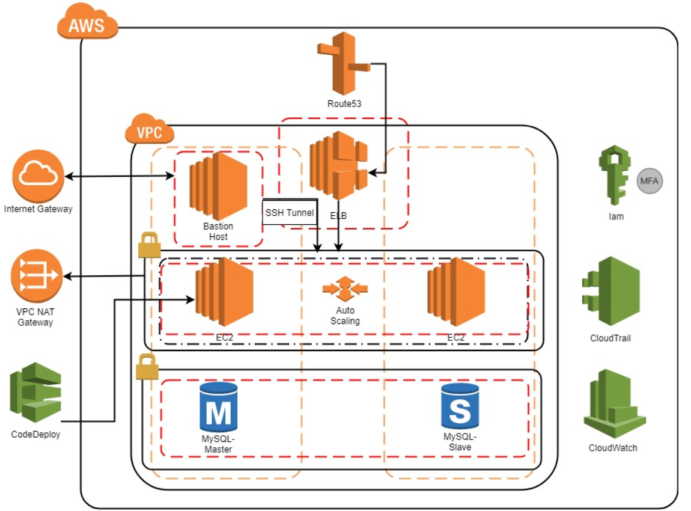
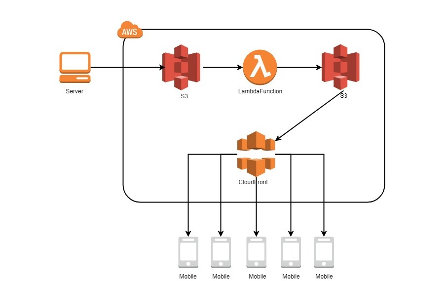
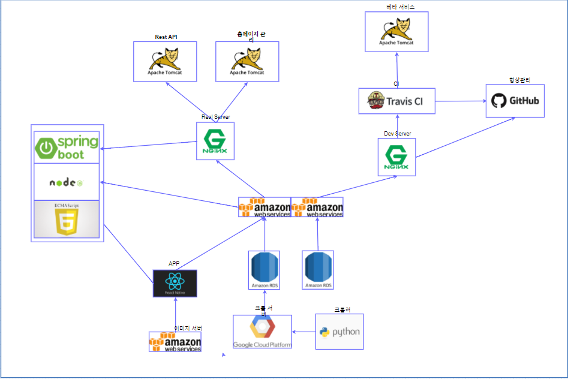

---
#### Index
[1. About Service](https://github.com/curious3856/intercomics#about-service)

[2. Installation](https://github.com/curious3856/intercomics#installation)

[3. About Tech](https://github.com/curious3856/intercomics#about-tech)

[4. About Tech](https://github.com/curious3856/intercomics#about-tech)

[5. About Team](https://github.com/curious3856/intercomics#about-team)

[6. About Project](https://github.com/curious3856/intercomics#about-project)

[7. All Links (Summary)](https://github.com/curious3856/intercomics#all-links)

---

# INTERCOMICS(beta 1.0.0 v)
> 여러 플랫폼의 웹툰을 한번에 볼 수 있고,
> 구독 기능을 통해 편하게 웹툰을 감상할 수 있는 통합 플랫폼 중계 서비스.

<br>

# About Service

## 목표

웹툰감상할 시간도 부족한데 웹툰 찾는시간이 더 오래걸린다.
- 사용자가 웹툰을 보기위해 설치해야할 App의 갯수를 줄이자.
- 사용자가 구독을 통해 웹툰 찾는 시간을 줄이자.
- 사용자에게 새로운 웹툰에 대한 접근을 유도하자.

***사용자가 웹툰을 감상하는데 필요한 시간을 줄이고, 웹툰 감상에만 에너지를 쏟게 하자.***

<br>

## 기능 요약

### 1. 웹툰(주요 기능)

- **요일별 웹툰**
  - 여러 플랫폼의 웹툰을 요일별로 보여준다.
  - 필터를 통해 보고싶은 플랫폼만 선택할 수 있다.

- **구독**
  - 감상하길 원하는 웹툰을 구독하여 감상할 수 있다.
  - 구독된 웹툰들을 요일별로 정렬하여 확인할 수 있다.
  
- **알림**
  - 구독된 웹툰의 에피소드가 추가되면 알림이 간다.

- **랭킹**
  - 인기있는 웹툰들의 랭킹을 보여준다.

- **내 정보**
  - 사용자가 여태까지본 에피소드, 구독 등의 갯수를 표시해준다.
  - 사용자가 가장 많이 이용하는 장르에 대한 그래프를 제공한다.

- **검색**
  - 원하는 웹툰들을 검색으로 찾을 수 있다.
  
<br>

### 2. 로그인
- 현재 페이스북 로그인만 지원.
- JWT방식 사용.

<br>

### 3. 캐싱
- 이미지 캐싱, 데이터 캐싱을 통해 데이터비용 절감.

<br>

# Installation

These instructions will get you a copy of the project up and running on your local machine.

Prerequisites
- Node.js v8^
- npm
- expo

Clone this project from the github repository.

```bash
$ git clone https://github.com/curious3856/intercomics
$ cd intercomics
```

Install packages in directory using following command:
```bash
$ npm i
```

run:
```bash
use expo
```

<br>


# About structure

## Folder Structure

```
./components
  ./Button
    - index.js
    - container.js
    - presenter.js
   
./navigations

./routs

./redux
  - configurations.js
  ./modules
    - user.js
   
./screens
  ./LoginScreen
    - index.js
    - container.js
    - presenter.js
   
constants.js
```

<br>

# About Tech

## 기술 스택 & 툴

### Prototype & Design
- 카카오 Oven

<br>

### ~~Frontend(개발 보류)~~
- ~~Stack~~
  - ~~react~~
  - ~~redux~~
  - ~~thunk~~
  - ~~CSS Module + Sass~~
  - ~~axios~~
  - ~~react-router~~
  - ~~immutable~~
  
  > 저작권 문제로 현재 개발 잠정보류.
  
<br>

- ~~etc~~
  - ~~yarn~~
  - ~~eslint~~

<br>

### App

- Stack

  - [react-native](https://facebook.github.io/react-native/)
  - [redux](https://redux.js.org/introduction)
  - redux-thunk
  - react-persist-store
  - react-native-navigation
  - react-native-elements
  - react-native-snap-carousel
  - axios
  - expo sdk
  - [react-native-elements](https://github.com/react-native-training/react-native-elements/) (CSS Framework)

<br>

- etc
  - npm, yarn
  - prettier (formatter)

<br>

### Backend

- Stack
  - Spring
  - Mybatis
  - Maven
  - Mysql
  
<br>

- etc
  - [Swagger UI](https://swagger.io/)

<br>

### Server
- [AWS](https://aws.amazon.com/ko/)
  - EC2
  - S3 (Image Storage)
  - ELB
  - VPC
  - CloudeWatch
  - Config
  - Route53
  - CloudeFront
  - CloudeWatch
  - CloudeTrail
  - RDS(Mysql)
  - Lambda
  
<br>

### Crawler

- Stack
 - python3
 - selenium
 - date, time
 - sqlArchemy
 - connections
 - boto3
 
<br>

- etc
 - pip
 - pipenv
 
<br>

---
## Release


- 메인 서버
  - AWS EC2 (Ubuntu v16.04)
  - AWS RDS (MySql v5.7.17)
  - AWS S3
  - ELB
  - Route53

<br>

- 서버 구조도

<p align="center">
  
</p>

- 이미지 서버
  - AWS S3
  - CloudeFront
  - Lambda(nodeJS)

<br>

- 이미지 서버 구조도

<p align="center">
  
</p>

<br>

- App 배포
  - travis CI
  - `exp build: xx`로 .apk, .ios 마켓 및 스토어에 배포

- 데이터베이스 구축 :: MySql
  - AWS RDS 연동

<br>

- 전체 구조도

<p align="center">
  
</p>


<br>

---

# About Team

<br>

> 학생 개발자 둘로 이루어진 프로젝트입니다. 

<br>
## Member

### App

 - [하헌우](https://github.com/curious3856/intercomics)

### ~~FrontEnd~~

 - ~~[하헌우]()~~
 > 저작권, 링크 문제로 잠정중단
 
### Backend

- [하헌우](https://github.com/curious3856/Inco-backend)
- [조규현](https://github.com/curious3856/Inco-backend)

### Crawler

- [하헌우](https://github.com/curious3856/Inco-crawler)
- [조규현](https://github.com/curious3856/Inco-backend)
<br>

## Collaboration
- ~~gitlab~~ : gitlab -> github 이전중.
- git, github: 소스 코드 버전 관리
- Trello: 협업 일정 공유, 관리 --> Github-Projects 이전중

<br>

---

## All Links

1. [Github-App](https://github.com/curious3856/Intercomics)

2. [Github-Backend](https://github.com/curious3856/inco-backend)

3. [Github-Crawler](https://github.com/curious3856/inco-crawler)

4. [Github Projects](https://github.com/curious3856/Intercomics/projects)

5. [API Document](https://github.com/curious3856/inco-backend/wiki/Home)

6. [UML](https://github.com/curious3856/inco-backend/wiki/00-%5BERD%5D-Intercomics-ERD)

7. [1차 베타버전 시연 동영상](https://www.youtube.com/watch?v=ofynSdkO130)

8. [~~앱스토어~~]()


> 정식배포 준비중입니다.
